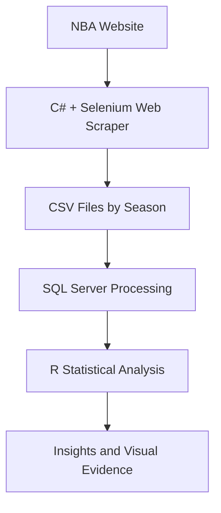
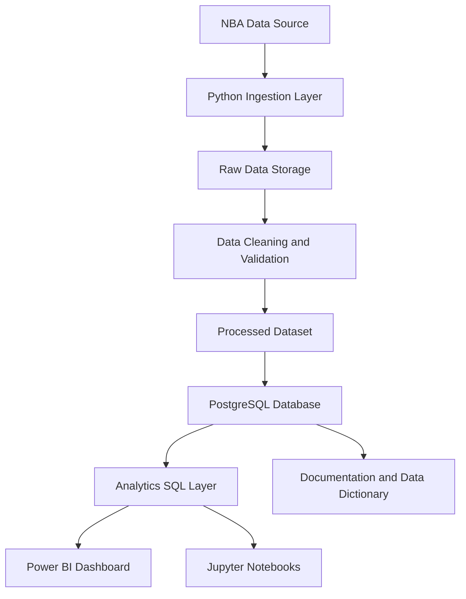

# NBA Data Platform Reconstruction

Modern reconstruction of a legacy academic NBA web scraping and analytics project into a professional Data Engineering and Analytics portfolio project.

## Project Context

This project was originally developed as an academic assignment focused on extracting historical NBA player statistics using web scraping techniques. The original solution used C#, Selenium, CSV files, SQL scripts and R-based analysis.

The goal of this repository is not only to preserve the original academic work, but to modernize it into a professional-grade data platform that demonstrates technical evolution, architectural thinking and modern engineering practices.

## Original Legacy Flow

## Target Modern Architecture

## Objectives

- Preserve the academic origin of the project.
- Reconstruct the data pipeline using modern tools.
- Consolidate historical NBA player statistics into a clean analytical dataset.
- Apply Data Engineering best practices.
- Create a recruiter-friendly GitHub portfolio project.
- Demonstrate maturity in architecture, documentation, analytics and maintainability.

## Planned Tech Stack

| Layer | Technology |
|---|---|
| Ingestion | Python |
| Processing | Pandas |
| Storage | CSV / Parquet |
| Database | PostgreSQL |
| Analytics | SQL / Power BI / Jupyter |
| Automation | GitHub Actions |
| Environment | Docker |
| Documentation | Markdown / Mermaid |

## Repository Status

This repository is currently in the reconstruction phase.

Current focus:

- Sprint 2: Modern Architecture Design
- Repository foundation
- Legacy documentation
- Target architecture definition
- Roadmap planning

## Roadmap

| Sprint | Focus | Status |
|---|---|---|
| Sprint 1 | Technical archaeology and baseline | Completed |
| Sprint 2 | Modern architecture design | In progress |
| Sprint 3 | Repository setup and legacy asset organization | Planned |
| Sprint 4 | Dataset consolidation | Planned |
| Sprint 5 | SQL model redesign | Planned |
| Sprint 6 | Python ETL pipeline | Planned |
| Sprint 7 | Analytics queries and insights | Planned |
| Sprint 8 | Power BI dashboard | Planned |
| Sprint 9 | Portfolio polish | Planned |

## Portfolio Narrative

> Originally developed as a university project focused on NBA web scraping and statistical analysis, this repository documents the reconstruction and modernization of the original solution using current Data Engineering, Analytics and Software Engineering practices.

## License

License to be defined during the repository stabilization phase.
