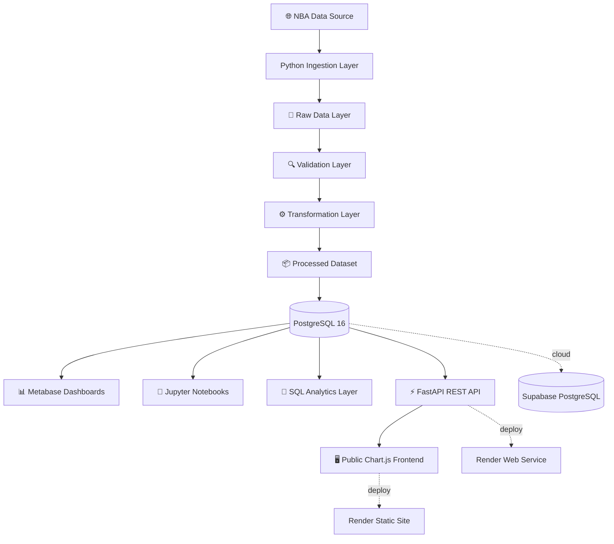

# 🏀 NBA Data Platform Reconstruction

> **From academic scraper to professional Data Engineering platform.**  
> A full modernization of a legacy NBA analytics project - preserving its origin, elevating its engineering.

[](https://python.org)
[](https://postgresql.org)
[](https://docker.com)
[](https://metabase.com)
[](https://pandas.pydata.org)
[](LICENSE)
[](https://github.com/GuilhermePires21890/nba-data-platform-reconstruction/actions/workflows/ci.yml)
[](https://fastapi.tiangolo.com)
[](https://supabase.com)
[](https://render.com)

---

## 📌 Project Status

| Area | Status |
|---|---|
| Portfolio-ready MVP | ✅ Completed |
| Sprints 1-14 | ✅ Completed |
| Public dashboard and API | 🟢 Live |
| CI pipeline | 🟢 Active on `main` |
| QA Spec Suite | 🟢 7 SPECs, 78 scenarios |

---

## 📖 Project Story

This project started as a **university assignment** in 2021/2022 at Instituto Superior Politécnico Gaya (Porto, Portugal).

The original goal was simple: extract historical NBA player statistics using web scraping.

The result was a working **end-to-end pipeline** built with C#, Selenium, CSV files, SQL Server and R - scraping **25 seasons of NBA data (1996-2021)**, covering **11,460 player records** across **332,340 data fields**.

**This repository is the reconstruction** - taking that academic foundation and rebuilding it as a professional Data Engineering and Analytics platform, demonstrating technical evolution, architectural maturity and modern engineering practices.

---

## 📊 Dataset Coverage

| Metric | Value |
|---|---|
| Seasons covered | 1996-97 to 2020-21 |
| Total seasons | 25 |
| Total player records | 11,460 |
| Total data fields | 332,340 |
| Statistical columns | 30 per record |

---

## 🏗️ Architecture Evolution

### Legacy Architecture (Original Academic Project)


**Stack:** C# · Selenium · CSV · SQL Server · R · ggplot2

---

### Modern Architecture (This Reconstruction)



**Stack:** Python · Pandas · PostgreSQL · Docker · Metabase · SQL · FastAPI · Supabase · Render · Chart.js

---

## 🚀 Tech Stack

| Layer | Technology | Purpose |
|---|---|---|
| Ingestion | Python + Pandas | Data extraction and consolidation |
| Storage | PostgreSQL 16 | Relational analytical database |
| Runtime | Docker Compose | Reproducible local environment |
| BI & Dashboards | Metabase | Interactive analytics and visualization |
| Analytics | SQL | Aggregations, rankings and historical analysis |
| REST API | FastAPI | Public API layer with Swagger documentation |
| Cloud DB | Supabase | Managed PostgreSQL cloud hosting |
| Cloud Deploy | Render | Web service and static site hosting |
| CI/CD | GitHub Actions | Automated testing and health validation |
| Frontend | HTML + Chart.js | Public analytics dashboard |
| Testing | pytest + httpx + psycopg2 | Transformation, API contract and data integrity tests |
| Security | slowapi + FastAPI middleware | Rate limiting, CORS restriction and security headers |
| Documentation | Markdown + Mermaid + ADRs | Architecture, governance and engineering decisions |

---

## 📈 Analytics Dashboards

Built with **Metabase** on top of **PostgreSQL**, covering 25 seasons of NBA history.

### Dashboard Preview

#### NBA Historical Analytics - 1996 to 2021


#### Top 10 Historical Scorers


#### Top 10 All-Time Assist Leaders


#### Top 10 All-Time Rebound Leaders


#### Top 10 Fantasy Points Leaders


### NBA Historical Analytics - 1996 to 2021

| Dashboard | Insight |
|---|---|
| 🏆 Top 10 Historical Scorers | LeBron James leads aggregate scoring across the dataset |
| 🎯 Top 10 All-Time Assist Leaders | Chris Paul ranks first in accumulated assists |
| 💪 Top 10 All-Time Rebound Leaders | Dwight Howard leads the historical rebound ranking |
| ⭐ Top 10 Fantasy Points Leaders | LeBron James leads multi-stat contribution |
| 🎯 3-Point Revolution | Tracks the league-wide evolution of three-point shooting |
| 🌟 Young Stars U25 | Identifies the strongest under-25 seasons |

> Dashboards are available locally via Metabase after environment setup.

---

## 🧠 Championship Predictor

The project includes a Championship Predictor Score model evaluated across the 25-season historical dataset.

| Metric | Result |
|---|---|
| Exact champion prediction accuracy | 16% |
| Champion ranked inside top 5 | 52% |
| Backtest coverage | 25 seasons |

These results are presented as model evaluation metrics. No unsupported comparison with a random baseline is used.

---

## 🌐 Live Platform

| Service | URL |
|---|---|
| **🖥️ Live Dashboard** | **https://nba-data-platform.onrender.com** |
| API Root | https://nba-data-platform-api.onrender.com |
| Swagger Docs | https://nba-data-platform-api.onrender.com/docs |
| Top Scorers | https://nba-data-platform-api.onrender.com/players/top-scorers |
| Seasons | https://nba-data-platform-api.onrender.com/players/seasons |
| Teams | https://nba-data-platform-api.onrender.com/players/teams |
| Analytics - Era Analysis | https://nba-data-platform-api.onrender.com/analytics/era-analysis |
| Analytics - Championship Predictor | https://nba-data-platform-api.onrender.com/analytics/championship-predictor |
| Analytics - 3-Point Revolution | https://nba-data-platform-api.onrender.com/analytics/3point-revolution |
| Analytics - Young Stars | https://nba-data-platform-api.onrender.com/analytics/young-stars |
| Player Career | https://nba-data-platform-api.onrender.com/analytics/players/{name}/career |

> Free tier - cold start may take 30-60 seconds after inactivity.

---

## 🧪 Quality Assurance

The platform includes a layered QA strategy covering transformation logic, API contracts, dataset integrity and operational health checks.

| Test Layer | Scope |
|---|---|
| Transformation tests | File parsing, season extraction, column normalization and schema validation |
| API contract tests | Status codes, response payloads, limits, filters and response-time baselines |
| Data integrity tests | Record counts, season coverage, null checks and statistical value ranges |
| CI health checks | PostgreSQL service startup, FastAPI startup and endpoint availability |

**Current test inventory:** 43 pytest tests across transformation, API contract, schema and data integrity coverage.

> Data integrity tests require database access and are intentionally separated from the isolated CI test subset.

See [ADR-005 - Testing Strategy](docs/adr/ADR-005-testing-strategy.md).

---

## 🔐 Security Posture

The public API is read-only and serves public sports statistics. Security controls have been implemented using a risk-based approach appropriate for a portfolio-grade public analytics platform.

### Implemented controls

- Restricted CORS policy for known frontend and local development origins
- Rate limiting using `slowapi` with endpoint-specific thresholds
- Parameterized PostgreSQL queries through `psycopg2`
- FastAPI/Pydantic validation for request limits and query parameters
- HTTP security headers, including HSTS, frame protection and content-type protection
- Secrets managed through environment variables in Render
- No authentication data or personally identifiable information stored
- Cloudflare and Render edge protections in front of the public services

### Security documentation

- [Security Audit](docs/security-audit.md)
- [ADR-006 - Security Strategy](docs/adr/ADR-006-security-strategy.md)

> The original audit report records the baseline before all mitigations were implemented. The current application code includes the rate limiting, CORS and security-header mitigations documented above.

---

## ⚡ Quick Start

### Prerequisites

- Docker Desktop
- Python 3.11+
- Git

### 1. Clone the repository

```bash
git clone https://github.com/GuilhermePires21890/nba-data-platform-reconstruction.git
cd nba-data-platform-reconstruction
```

### 2. Configure environment

```bash
cp .env.example .env
```

### 3. Start the platform

```bash
docker compose up -d
```

### 4. Set up Python environment

```bash
python -m venv .venv
source .venv/bin/activate  # macOS/Linux
pip install -r requirements.txt
```

### 5. Run the isolated test suite

```bash
pytest tests -v
```

### 6. Verify the platform

```bash
docker ps
# Expected: nba_postgres (Up) · nba_metabase (Up)
```

### 7. Access Metabase

```text
http://localhost:3001
```

---

## 📁 Repository Structure

```text
nba-data-platform-reconstruction/
│
├── data/
│   ├── raw/legacy_csv/          # Original scraped CSV files (25 seasons)
│   ├── processed/               # Consolidated analytical dataset
│   └── curated/                 # Analytics-ready outputs
│
├── docs/
│   ├── adr/                     # Architecture Decision Records
│   ├── screenshots/             # Dashboard evidence
│   ├── architecture.md          # System architecture overview
│   ├── data-dictionary.md       # Column definitions and metadata
│   ├── legacy-analysis.md       # Original project analysis
│   ├── modernization-strategy.md
│   └── security-audit.md        # Security baseline and test evidence
│
├── notebooks/
│   └── exploratory_analysis.md  # EDA planning and analysis
│
├── sql/
│   ├── schema/                  # Table definitions
│   ├── analytics/               # Analytical queries
│   ├── transformations/         # Data loading scripts
│   └── views/                   # Reusable analytical views
│
├── src/
│   ├── api/                     # FastAPI application and routers
│   ├── transformation/          # Dataset consolidation pipeline
│   ├── validation/              # Schema and data quality validation
│   └── utils/                   # Shared configuration and utilities
│
├── tests/                       # Automated test suite
├── frontend/                    # Public Chart.js dashboard
├── .github/workflows/           # GitHub Actions CI pipeline
├── docker-compose.yml           # Platform orchestration
├── requirements.txt             # Python dependencies
└── .env.example                 # Environment configuration template
```

---

## 🗺️ Roadmap

| Sprint | Focus | Status |
|---|---|---|
| Sprint 1 | Technical archaeology and baseline | ✅ Completed |
| Sprint 2 | Modern architecture design | ✅ Completed |
| Sprint 3 | Repository setup and legacy asset organization | ✅ Completed |
| Sprint 4 | Dataset consolidation and PostgreSQL ingestion | ✅ Completed |
| Sprint 5 | Metabase analytics dashboards | ✅ Completed |
| Sprint 6 | GitHub polish and professional documentation | ✅ Completed |
| Sprint 7 | Advanced SQL analytics and Championship Predictor | ✅ Completed |
| Sprint 8 | FastAPI REST layer | ✅ Completed |
| Sprint 9 | CI/CD with GitHub Actions | ✅ Completed |
| Sprint 10 | Cloud deployment - Supabase PostgreSQL + Render Web Service | ✅ Completed |
| Sprint 11 | Public frontend and live API integration | ✅ Completed |
| Sprint 12 | ADR completion, QA/security documentation and auto-deploy validation | ✅ Completed |
| Sprint 13 | API Analytics Endpoints - championship-predictor, era-analysis, 3point-revolution, young-stars, player-career | ✅ Completed |
| Sprint 14 | Super SPEC + QA Expert documentation - Gherkin/BDD - 7 SPECs, 78 scenarios | ✅ Completed |

### Planned Sprint 13 endpoints

- `GET /analytics/championship-predictor`
- `GET /analytics/era-analysis`
- `GET /players/{name}/career`
- `GET /analytics/3point-revolution`
- `GET /players/young-stars`

---

## 📐 Architecture Decision Records

| ADR | Decision | Status |
|---|---|---|
| [ADR-001](docs/adr/ADR-001-use-postgresql.md) | PostgreSQL as primary database | ✅ Accepted |
| [ADR-002](docs/adr/ADR-002-python-etl.md) | Python for ingestion and transformation | ✅ Accepted |
| [ADR-003](docs/adr/ADR-003-docker-environments.md) | Docker Compose for reproducible environments | ✅ Accepted |
| [ADR-004](docs/adr/ADR-004-metabase-dashboards.md) | Metabase for BI and dashboards | ✅ Accepted |
| [ADR-005](docs/adr/ADR-005-testing-strategy.md) | Layered testing strategy | ✅ Accepted |
| [ADR-006](docs/adr/ADR-006-security-strategy.md) | Risk-based security strategy | ✅ Accepted |

---

## 🎓 Academic Origin

> **"Today, sports statistics and analytics are omnipresent and have become a very important factor in decision-making in sports."**  
> - Original academic paper, ISPGaya 2022

**Original project facts:**

- **Institution:** Instituto Superior Politécnico Gaya, Porto, Portugal
- **Year:** 2021/2022
- **Original stack:** C# · Selenium · CSV · SQL Server · R
- **Data scraped:** 25 NBA seasons (1996-2021)
- **Records extracted:** 11,460 player records

The academic project demonstrated genuine end-to-end thinking - from web extraction to statistical analysis. This reconstruction preserves that narrative while elevating the engineering maturity.

---

## 🤝 Contributing

This is a portfolio project under active development.  
Feedback, suggestions and issues are welcome via [GitHub Issues](https://github.com/GuilhermePires21890/nba-data-platform-reconstruction/issues).

---

## 📄 License

MIT License - see [LICENSE](LICENSE) for details.

---

<p align="center">
  <strong>Built in Porto, Portugal 🇵🇹</strong><br/>
  Academic origin · Professional reconstruction · Engineering evolution
</p>
