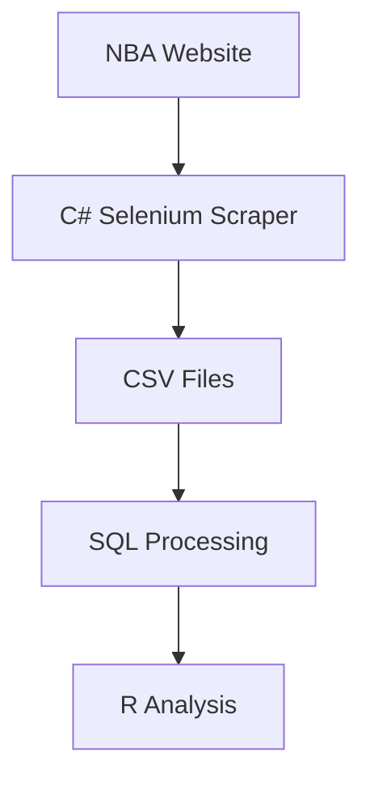
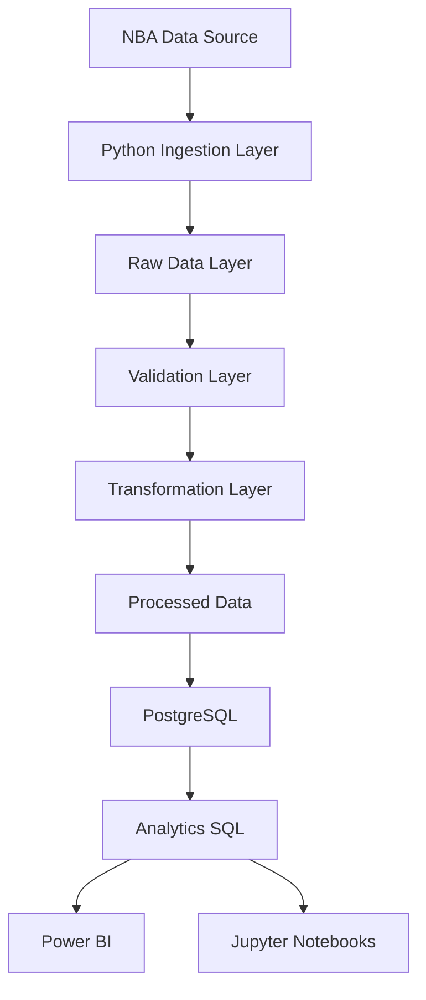

# Architecture Overview

## Objective

This document defines the target architecture for the modern reconstruction of the original NBA academic project.

The new platform aims to evolve the legacy scraping and analytics solution into a modular, scalable and portfolio-grade Data Engineering platform.

---

# Legacy Architecture

## Characteristics

- Monolithic execution flow
- Manual data ingestion
- Local processing
- Separate CSV files per season
- SQL scripts with repetitive transformations
- Statistical analysis executed independently

---

# Modern Target Architecture

---

# Architectural Principles

## 1. Modularity

Each processing layer should have isolated responsibilities.

## 2. Reproducibility

The entire platform should be reproducible using Docker and version-controlled scripts.

## 3. Documentation-first

Technical decisions must be documented.

## 4. Portfolio-oriented engineering

The repository should demonstrate:

- Data Engineering practices
- Architecture thinking
- Data modeling
- Analytics
- Documentation quality
- Technical evolution

---

# Future Evolution Possibilities

- API ingestion
- Incremental loads
- Cloud deployment
- Data warehouse modeling
- Automated testing
- CI/CD pipelines
- dbt transformations
- Observability and logging
